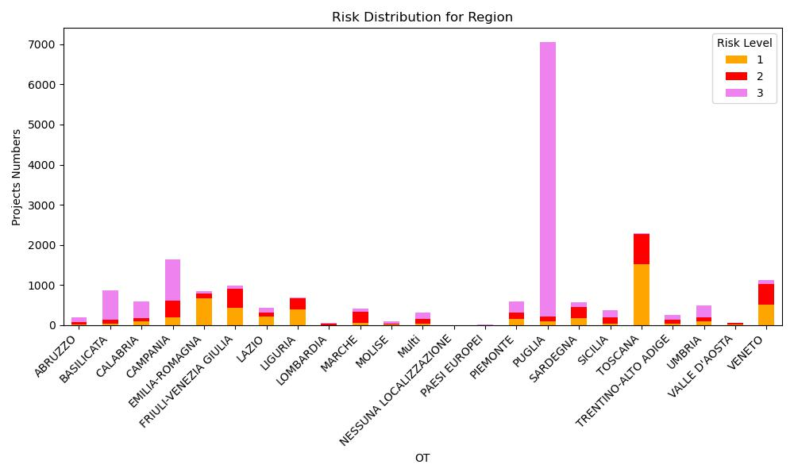
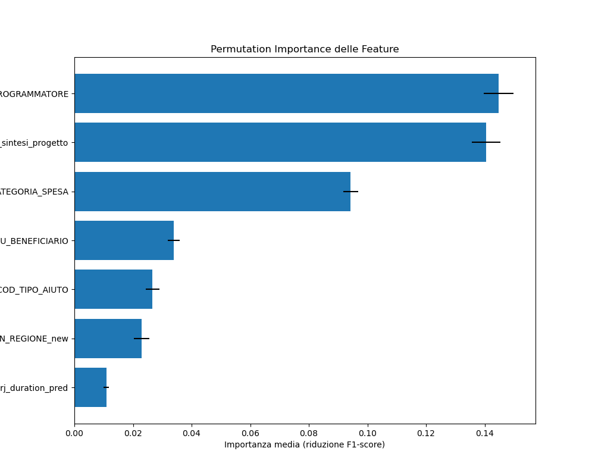
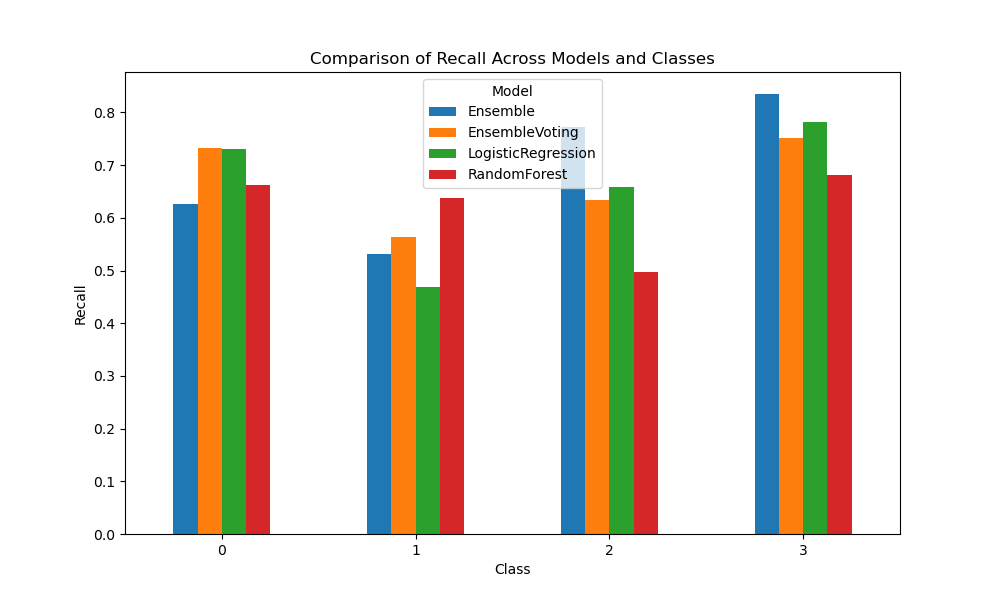

#### Executive summary

The application aims to create a tool to assess the risk level of publicly funded projects, enabling greater attention to those at risk of significant delays, failure to close within the program's timeframe, or underutilization of allocated funds. Funds that remain unused could otherwise be redirected to other projects beneficial to the community.

To achieve this, we start with a dataset of projects concluded by December 31, 2023 (at the latest) from the 2014–2020 funding period, as these data should now be stable. This dataset will be used to train the model, which will then be applied to new projects from the 2021–2027 funding period.

Numerous inconsistencies were identified in the available information, necessitating the use of data engineering techniques to adapt the data. Most of the available information is categorical, resulting in a large volume of data for training. Consequently, it is essential to adapt these data to reduce the training time for the model.

Additionally, the training dataset is highly imbalanced, with the majority of projects falling into the "noRisk" category. To address this, techniques will be employed to mitigate the effects of this imbalance.

The final output has been developing a model to apply for feature classification of new projects (2021–2027), which can then be monitored at early deadlines with clear risk-level exposure. This approach will enable more proactive management and better allocation of public resources.
For resources constraints we built different notebook (serialized) and one main to put all together.

The model selected is: [Model](data_output/Lav_1_work_3.3-Esemble_W_BM.pkl)

#### Rationale
The study is critical as it addresses the need to optimize public resource management by identifying projects at risk of failure. This approach enables proactive intervention and better allocation of funds, ultimately ensuring more efficient use of public resources.

#### Research Question
Can we predict the risk level (low, medium, or high) of ongoing publicly funded projects in Italy, based on available project data, to improve public resource management?

#### Data Sources
The primary data source will be OpenCoesione (https://opencoesione.gov.it/it/opendata/#!progetti_section). The dataset for projects spanning 2014–2020 will serve as the training dataset, while projects from 2021–2027 will be used for testing.

I used at the moment:
[Project portfolio 2014-2020 -- too large not imported](Data_OC/progetti_esteso_2014-2020_20240831.parquet)
[Project portfolio 2014-2020 -- imported for 2014-2020 FESR - part of the total not imported](Data_OC/df1.parquet)
[Project portfolio 2021-2027](Data_OC/progetti_esteso_2021-2027_20240831.parquet)
[Metadata structure of project information](Data_OC/metadati_progetti_tracciato_esteso.parquet)

# Project Risk Analysis and Prediction

This repository focuses on analyzing and predicting project risks, particularly those related to POR/FESR 2014-2020 funds. The analysis and models aim to identify high-risk projects and provide a reliable risk classification.

---

## Dataset and Preprocessing

### Source Data

- **Dataset**: [Progetti Esteso 2014-2020](https://opencoesione.gov.it/it/opendata/dataset/progetti_esteso_2014-2020/)
- **File**: [Starting Dataset](Data_OC/progetti_esteso_2014-2020_20240831.parquet)

### Steps:

1. **Subset Selection**:

   - Extracted records related to POR/FESR 2014-2020.
   - Created from the source file: [df1](Data_OC/df1.parquet)
   - [Notebook](1_Create_df_lav1_v5_.ipynb)

2. **Data Cleaning**:

   - Fixed date formats to `yyyy-mm-dd`.
   - Set `null` end dates to `31-12-2099` to mark ongoing projects.
   - Dropped columns with more than 40% missing values.
   - Removed rows with less than 6% missing values.
   - Eliminated columns with ~25% missing data deemed irrelevant.

3. **Output**:

   - [Cleaned dataset](data_output/df_lav.csv)

---

## Feature Engineering

### New Features

1. **Delay**: Project delay in days.
2. **Prj_duration_pred**: Predicted project duration.
3. **Perc_contrib_nok**: Percentage of unspent contributions.
4. **Marginal_cost**: Daily cost of the project.

### Risk Labeling

Using **Delay** and **Perc_No_Ue**, projects were labeled into four risk categories:

- **High Risk (Level 3)**: Delay ≥ 1825 days OR Non-EU contributions ≥ 50%.
- **Moderate Risk (Level 2)**: Delay between 365–1825 days OR Non-EU contributions 25–50%.
- **Low Risk (Level 1)**: Delay between 180–365 days OR Non-EU contributions 15–25%.
- **No Risk (Level 0)**: Does not meet any above conditions.

**Visualization**:  

---

## Feature Selection

### Metadata Analysis

- [Analyzed using](Data_OC/metadati_progetti_tracciato_esteso.xlsx)
- Columns categorized with prefixes:
  - **Anag**: Demographic data.
  - **Prog**: Programming data.
  - **Terr**: Localization.
  - **Temp**: Temporal info.
  - **Avan**: Progress status.
  - **Proc**: Process state.
  - **Indi**: Indicators.
  - **Flag**: Informational flags.
  - **Aggi**: Additional data.
  - **Sogg**: Stakeholders.
  - **New**: Newly created features.

### Selection Rules

- **Initial Rules**:

  - **Keep**:
    - "Anag_" columns excluding `Anag_cod_locale_progetto` and `Anag_oc_link`.
    - "Prog_" or "Altr_" columns with "COD".
    - "Terr_" columns with "DEN".
    - "Sogg_" columns: `Sogg_OC_DENOM_BENEFICIARIO` and `Sogg_OC_DESCR_FORMA_GIU_BENEFICIARIO`.
    - All "New_" columns.
  - **Remove**:
    - All "Temp_", "Avan_", "Proc_", "Indi_", "Flag_", and "Aggi_" columns.

- **Refinement**:

  - After several tests and feature analyses, certain conditions were adjusted to include potentially relevant features and exclude others.
  - Attempted to incorporate population cluster aggregation in municipalities involved in the projects. However, this feature did not contribute significantly to the baseline model's performance.

### Output:

- [Updated and refined dataset saved as:](data_output/df_lav1.csv)

---

## Model Applications

### Objective:

Focus on predicting high-risk projects, prioritizing **Level 3**, then **Level 2**, followed by **Level 1**. Optimization targeted **recall** over **precision**.

### Models Tested

1. **Linear Regression**:

   - [Notebook](2_Lav_1_work_3.3-LR_W.ipynb)
   - Techniques: SMOTE, undersampling, and weighting (this is applied at the end, for the best results)
   -  : this cosideration has contribute to re - select the features cycling, to arrive the actual final version.

   - Final output:
     - [Metrics](data_output/Lav_1_work_3.3-LR_W.pkl)
     - [Model](data_output/Lav_1_work_3.3-LR_W_BM.pkl)

2. **Random Forest**:

   - [Notebook](3_Lav_1_work_3.3-RF_W.ipynb)
   - Outputs:
     - [Metrics](data_output/Lav_1_work_3.3-RF_W.pkl)
     - [Model](data_output/Lav_1_work_3.3-RF_W_BM.pkl)

3. **Ensemble Stacking**:

   - [Notebook](4_Lav_1_work_3.3-Esemble_stacking_W.ipynb)
   - Outputs:
     - [Metrics](data_output/Lav_1_work_3.3-Esemble_W.pkl)
     - [Model](data_output/Lav_1_work_3.3-Esemble_W_BM.pkl)

4. **Ensemble Voting**:

   - [Notebook](5_Lav_1_work_3.3-Esemble_voting_W.ipynb)
   - Outputs:
     - [Metrics](data_output/Lav_1_work_3.3-Esemble_Voting_W.pkl)
     - [Model](data_output/Lav_1_work_3.3-Esemble_Voting_W_BM.pkl)

---

## Model Comparison

### Evaluation:

- Metrics: Precision, Recall, F1 across risk classes.
- Priority: High recall for **Level 3** and **Level 2**.

**Visualization**:  

**Best Model**:  
**Ensemble Stacking** [Model Selected](4_Lav_1_work_3.3-Esemble_stacking_W.ipynb)  
- Recall for Level 3: **0.83**.  
- Recall for Level 2: **0.77**.

